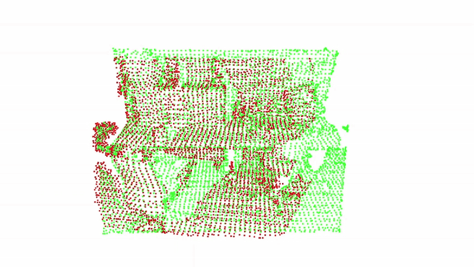

# Point Cloud Registration (Global + ICP)
This module performs **incremental registration** of point clouds.  
It uses:

- **Global Registration** (RANSAC)
- **Custom ICP refinement** (implemented with `scipy.optimize.least_squares`)
- An **Open3D Visualization** of the incremental registration made by custom icp refinement
- An **Open3D GUI** where you can toggle visibility and modify colors of:
  - Original point clouds  
  - Globally registered point clouds  
  - Fully registered (ICP) point clouds  

This tool provides full transparency of the registration pipeline, useful for debugging and analysis.

---

## How to Run the Script

To run the registration using the default input folder:

```bash
python3 icp_optimization/main.py
```
<td></td>
---
## What you should expect


