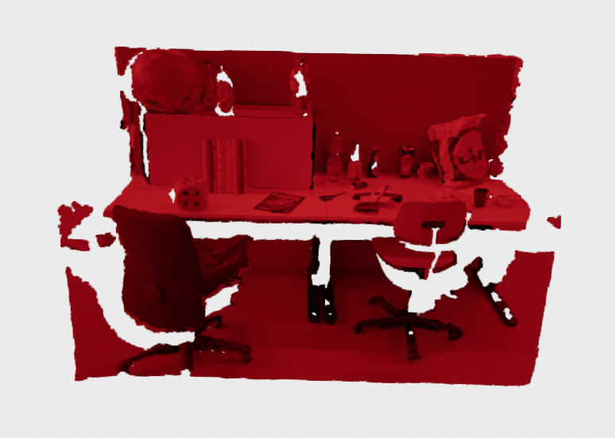
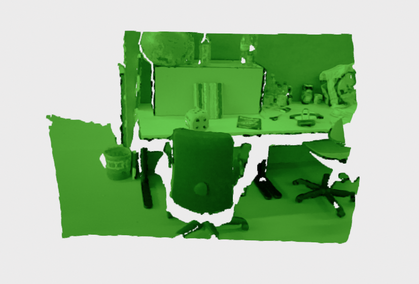
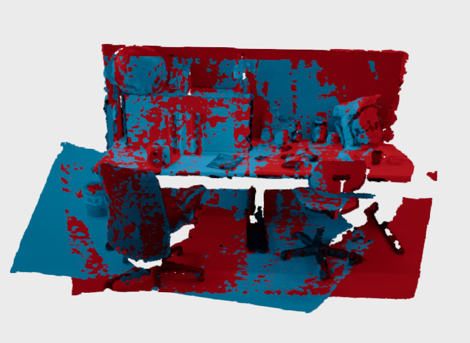

# Pairwise Point Cloud Registration (Global RANSAC + ICP)

This module demonstrates how to register multiple point clouds into a common reference frame using Open3D.  
The pipeline combines a **global registration** step (FPFH + RANSAC) with a **local refinement** step (ICP Point-to-Plane), and includes an interactive GUI to toggle visibility and color of both original and registered point clouds.

---

## How to run the code

To run the script with the default folders (using the point clouds generated by the `image_to_cloud` module):

```bash
python3 icp_tutorial/main.py
```

By default, the script...

- reads all .pcd files from:

```bash
image_to_cloud/output_clouds
```
- writes the accumulated registered point cloud to:

```bash
icp_tutorial/cloud_registered/cloud_registered.pcd
```

- and opens an interactive GUI to visualize:

  - the original point clouds (Show PointCloud Original)

  - the registered point clouds (Show PointCloud Registered)


If you want to change the input folder, ouput folder or voxel size, you can use:

```bash
python3 icp_tutorial/main.py \
    -ifd image_to_cloud/output_clouds \
    -outpcd icp_tutorial/cloud_registered \
    -voxS 0.04
```

## Input Example (Point Clouds)

Below we show the two input point clouds before registration:

<table>
  <tr>
    <th>Input Cloud 0</th>
    <th>Input Cloud 1</th>
  </tr>
  <tr>
    <td></td>
    <td></td>
  </tr>
</table>

These clouds are in different poses and must be aligned into a common reference frame.


## Output Example (Registered Cloud)

After running the script, both clouds are aligned:

<table>
  <tr>
    <th>Accumulated Registered Cloud</th>
  </tr>
  <tr>
    <td></td>
  </tr>
</table>

