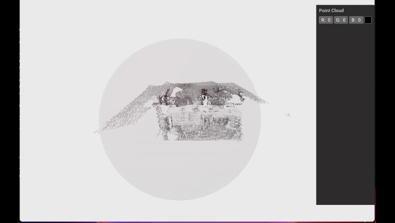

# Minimum Enclosing Sphere Optimization

This module computes the **minimum enclosing sphere** of a point cloud using a constrained optimization approach (SLSQP).  
The algorithm estimates the **sphere center** \((x_c, y_c, z_c)\) and **radius** \(r\) such that all points lie inside the sphere while minimizing the radius.  

A real-time Open3D GUI is included to visualize:
- the input point cloud;  
- the sphere being updated at each optimization iteration;  
- interactive color control for the point cloud.  

---

## How to run the code

To run the script with the default input (registered cloud generated by the ICP tutorial):

```bash
python3 minimum_enclosing_sphere_optimization/main.py
```

By default, the script...

- reads the point cloud from:

```bash
minimum_enclosing_sphere_optimization/pcd_to_work/cloud_registered.pcd
```
- performs SLSQP optimization with inequality constraints

- visualizes:

  - the input point cloud

  - a transparent sphere that updates at each iteration

If you wish to use a different point cloud, simply replace the file inside:

```bash
minimum_enclosing_sphere_optimization/pcd_to_work/
```

## What you should Expect 

<table> 
  <tr>
    <th>Cloud + Enclosing Sphere</th>
  </tr>
  <tr> 
    <td></td> 
  </tr>
</table>


